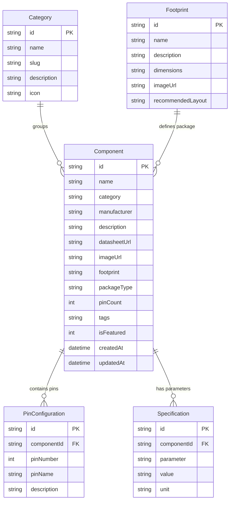

# ElectroBase ⚡

[](https://nextjs.org/)
[](https://react.dev/)
[](https://tailwindcss.com/)
[](https://prisma.io/)
[](https://turso.tech)
[](https://www.typescriptlang.org/)

**ElectroBase** is the ultimate all-in-one electronics and hardware component reference library built for hardware engineers, professional designers, and makers. Browse, search, and instantly access technical specifications, pinout configurations, footprint dimensions, and datasheet previews for a massive catalog of components in one place.

---

## 🎨 Premium Visual Design & Aesthetics

ElectroBase features a bespoke, premium design that prioritizes readability, accessibility, and modern aesthetics:
* **Glassmorphism Panels**: UI cards and sidebars utilize frosted-glass styling (`backdrop-blur-md` and semi-transparent borders) that float gracefully over a deep, dark canvas.
* **Vibrant Accent Colors**: A curated color palette of neon cyans (`text-cyan-400`), emerald greens, and warm ambers provides visual hierarchy and retro-futuristic terminal vibes.
* **Micro-Animations**: Hover states, interactive calculator results, and package pins animate with smooth transitions to feel dynamic and alive.
* **Responsive Layouts**: Designed to look stunning on huge desktop monitors (for workspace references) down to mobile phones (for debugging on the bench).

---

## 🔌 Core Advanced Features

### 1. Interactive Pinout Visualizer
A dynamic React component that renders the physical packages of integrated circuits and modules.
* **DIP / SOIC Packages**: Beautiful chip rendering with left-right dual-row pins and a package notch showing pin numbers, names, and index orientation.
* **Single-row / Header Packages**: Clear inline pin strips for modules (e.g., microcontrollers, sensors).
* **3-Lead Packages**: Renders packages like **TO-220**, **TO-92**, and **SOT-23** with visual metallic leads.
* **Bidirectional Interactive Highlighting**: Hovering over a pin on the visual model automatically highlights the corresponding row in the datasheet table, and hovering a row in the table highlights that pin on the physical rendering!

### 2. Interactive Engineering Calculators Suite
A full suite of electronics calculators integrated into the main navigation:
* **Resistor Color Code Decoder**:
  * Supports both **4-band** and **5-band** configurations.
  * Updates a visual resistor model's band colors dynamically in real-time as you select parameters.
  * Instantly computes total resistance value, multiplier, and tolerance limits.
* **555 Astable Frequency Calculator**:
  * Enter values for $R_1$, $R_2$, and $C_1$.
  * Computes time period, frequency, duty cycle, and high/low state durations.
  * Shows a dynamic CSS-animated square wave illustrating the computed duty cycle.
* **LM317 Adjustable Regulator**:
  * Calculates the exact output voltage ($V_{out}$) based on resistor ratios ($R_1$ and $R_2$).
* **LED Series Resistor Calculator**:
  * Input source voltage, forward voltage drop, and forward current.
  * Yields the recommended current-limiting resistance, expected power dissipation, and safe resistor power ratings.

### 3. Dynamic Vector Schematic SVGs
* For components without physical pictures, ElectroBase features a custom SVG renderer generating native vector schematic symbols.
* Covers **16 categories** (e.g., Op-amps, Inductors, Resistors, Capacitors, LEDs, Diodes, Crystals, Antennas, Logic Gates, etc.).
* Symbols automatically scale and fit the dark-mode aesthetic seamlessly.

### 4. Embedded PDF Datasheet Viewer
* Load and preview official datasheets inside the application!
* Features an expandable/collapsible toggle ("Embedded Viewer") that loads the PDF in-page via standard embedding, enabling side-by-side spec comparison without opening browser tabs.

### 5. Equivalents & Cross-Reference Engine
* Automatically lists potential pin-compatible alternative parts.
* Suggestions are queried dynamically matching the same product category and having the exact same pin count.

### 6. Local Favorites System
* Bookmark your most-used components with a single click.
* Bookmarks are saved directly in local browser storage for instant retrieval.

---

## 📂 Project Architecture

```bash
ElectroBase/
├── prisma/
│   ├── dev.db            # Local SQLite database
│   ├── schema.prisma     # Prisma Data Model definitions
│   ├── seed.ts           # Rich database seed file (81+ real components)
│   └── sync-turso.ts     # Turso/LibSQL database syncing script
├── public/               # Static assets & manufacturer logo images
└── src/
    ├── app/
    │   ├── layout.tsx    # App shell & styling entry
    │   ├── page.tsx      # Main dashboard with component counters & stats
    │   ├── about/        # About & Developer details page
    │   ├── admin/        # Admin panel for CRUD operations
    │   ├── calculators/  # Interactive calculators page
    │   └── components/   # Catalog explorer, footprint view, & detail views
    ├── components/
    │   ├── component-card.tsx  # Interactive catalog card with SVG fallbacks
    │   ├── pinout-visualizer.tsx # Multi-package interactive pin diagram
    │   └── ui/           # Shared glassmorphism panels & buttons
    └── lib/
        ├── constants.ts  # Shared lists (categories, manufacturers)
        └── schematic-svgs.tsx # SVG vector symbol path generator
```

---

## 📊 Database Schema Relationships



---

## 🚀 Setup & Local Installation

### Prerequisites
* **Node.js** v18 or later
* **npm** v9 or later

### Local Setup
1. **Clone the repository and install dependencies:**
   ```bash
   npm install
   ```

2. **Configure your Environment Variables:**
   Create a `.env` file in the root directory:
   ```env
   DATABASE_URL="file:./prisma/dev.db"
   ADMIN_PASSWORD="your-admin-password"
   ```

3. **Generate Prisma Client and Initialize Schema:**
   ```bash
   npx prisma generate
   npx prisma db push
   ```

4. **Seed the Database:**
   Populate the catalog with 16 core categories, 11 footprints, and 81+ real-world components:
   ```bash
   npm run seed
   ```

5. **Run the Development Server:**
   ```bash
   npm run dev
   ```
   Open [http://localhost:3000](http://localhost:3000) to view the portal.

---

## ☁️ Deployment (Vercel & Turso Sync)

ElectroBase uses **Vercel** for serverless hosting and **Turso** for a fast, globally distributed SQLite database.

### 1. Database Synchronization Script
Because standard `prisma db push` commands can hit SQL compiler limitations when pushing custom SQLite schema files directly to LibSQL endpoints, ElectroBase includes a direct syncing client in [sync-turso.ts](file:///c:/Users/SelvaUx/OneDrive/Desktop/ElectroBase/prisma/sync-turso.ts).

Run the syncing script using:
```bash
npx tsx prisma/sync-turso.ts
```

### 2. Environment Variables Configuration
Configure these production keys in Vercel or your deployment environment:

| Variable Name | Description | Example / Format |
|---|---|---|
| `DATABASE_URL` | Prisma Connection String (Vercel uses SQLite adapter) | `libsql://your-db.turso.io` |
| `TURSO_DATABASE_URL` | Turso DB URL | `libsql://your-db.turso.io` |
| `TURSO_AUTH_TOKEN` | Turso authentication token | `eyJhbGciOiJFZERTQSIsInR5cCI6IkpX...` |
| `ADMIN_PASSWORD` | Password to unlock administrative edits | `yoursecurepassword` |

---

## 👥 Meet the Developers

We are a small team of engineers passionate about building reference tools for physical hardware:

* **Jeyendrakumar** — *Project Lead & Developer*
  * Responsible for core application architecture, database configuration, and full-stack integration.
  * [Portfolio](#) • [Website](#)

* **Selva.Ux** — *Developer & Designer*
  * Created the UI/UX design system, color palettes, responsive web panels, interactive SVG Pinout Visualizer, and components library.
  * [Website (selvaux.in)](https://selvaux.in) • [GitHub (selvaux)](https://github.com/selvaux) • [Email](mailto:contact@selvaux.in)

---

## 📄 License
This project is open-source and available under the [MIT License](LICENSE).
